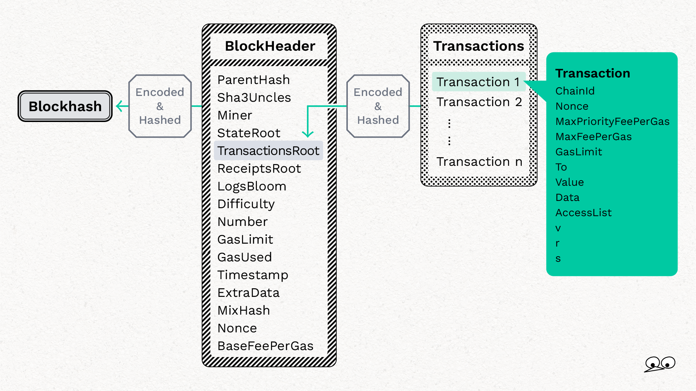

# contract overview


# Sequence diagram

## Layer2 →　Layer1


## Layer1 →　Layer2 (Upward trade)


# Mechanism

## Trade

As you can see in sequence diagram, the way of trade changed depending on the direction of trade.

For L1 to L2 trade, user can start trade by directly sending asset to relayer. Specify the networkCode of the destination chain as the last 4 digits of the amount when sending asset.

For L2 to L1 trade, user can start trade by executing `newTrade()`.

For now, user can trade on L2 to L2 by executing `newTrade()` if the networkCode is registered in availableNetwork, however we have not developed slash function for L2 to L2. We will develop slash mechanism for L2 to L2 trade.

## Network code

Each supported network has its own `networkCode`,  and we have `availableNetwork` and `slashableNetwork` to manage tradable network. Also, those two mappings will be used between L2 to L2 trade.

- availableNetwork : You can trade on the network registered in this mapping.
- slashableNetwork : You can slash on the network registered in this mapping. Therefore, you can't slash on the network that is not registered in this mapping even if that network is registered in availableNetwork.

## Bond

**Amount of bond required for relayer**

Relayer deposit bond in advance in order to respond to trade. The required deposit amount is calculated by `tradeThreshold * tradableBondRatio / 100`. `tradeThreshold` is the maximum amount of trade and the relayer can change this value. `tradableBondRatio` is the ratio to calculate the amount of bond, also can be changed by relayer.

**Locking period of bond**

Bond will be locked for `UPDATE_PERIOD` in BondManager.sol, currently 3 hours, after requested bond withdrawal. The reason for the lock period is that, for example, a malicious relayer can withdraw the bond immediately after submitting invalid evidence and take away the user’s funds by pretending to have accepted the trade.
Therefore, if a bond deposited b relayer is unlock within `UPDATE_PERIOD` ,the relayer cannot accept the trade.

## Slash

When and how slash will be executed is different depending on trade direction.

For L1 to L2 trade, disputer can execute slash when the relayer does not treat trade, and can slash the deposit if the evidence is valid.

For L2 to L1 trade, dispute can execute slash when relayer submitted invalid evidence, and can slash if the evidence is invalid.

**L1 to L2**

If the user sends an asset to the relayer in L1 but the relayer does not send an asset in L2 after the UPWARD_SLASH_START time passed, the disputer can execute `slashUpwardTrade()`.

If the evidence submitted as an argument of `slashUpwardTrade()` was valid, the bond will be slashed according to that evidence.

Before executing `slashUpwardTrade()`, the disputer must send the blockhash containing the transaction that the user sent to the relayer on L1 to L2 using checkpoit manager.

After the blockhash is relays to L2, the disputer generates an Evidence based on the transaction hash and executes `slashUpwardTrade()`.

**L2 to L1**

If the relayer register an invalid evidence when execute withdraw(), the disputer can execute slash().

The disputer must send a blockhash from L1 to L2 based on the block number contained in the evidence before execute slash().

However, the disputer does not need to generate the evidence to execute slash(), you can just retrieve the evidence from the log when the relayer executed withdraw().

## Functions to use slash

### Evidence

```solidity
struct Evidence {
		uint256 blockNumber;
		bytes32 blockHash;
		bytes[] txReceiptProof;
		bytes[] txProof;
		bytes transaction;
		uint8[] path;
		bytes txReceipt;
		bytes[] rawTx;
		bytes[] rawBlockHeader;
}
```

Evidence consists of the data which are necessary to prove whether a particular transaction is contained in a particular block.

You can generate evidence by using `composeEvidence()` in ethereum proof library.

In `composeEvidence()`, you can create an Evidence by fetching all block data from specific transaction hash using web3.js library and calculating where the specific transaction is located in the block.

[https://github.com/youkchan/ethereum-proof/blob/main/src/EthereumProof.ts#L151-L237](https://github.com/youkchan/ethereum-proof/blob/main/src/EthereumProof.ts#L151-L237)


Basically, when slashing, we verify whether a specific transaction is included in a specific block from the submitted Evidence.



### nativeIsNotETH

For the trade between L2 and other L1 chain that native token is not ETH, we use same slashing mechanism with L2 to L1 and L2 to L2 trade.
However, the slashing condition is different for the trade that destination is polygon because polygon uses WETH instead of ETH, so we have to set `nativeIsNotETH` to change slashing condition in `safeCheckEvidenceExceptBlockHash()`.

### Main function

```solidity

// PheasantNetworkBridgeChild.sol

function isValidEvidence(Types.Trade memory _trade, Types.Evidence calldata _evidence) public view returns (bool) {
		return safeCheckEvidenceExceptBlockHash(_trade, _evidence)
			&& disputeManager.verifyBlockHash(_evidence.blockHash, _trade.destCode, _evidence.blockNumber);
}

function safeCheckEvidenceExceptBlockHash(Types.Trade memory _trade, Types.Evidence calldata _evidence) public view returns (bool) {
		bool isValidTx = false;

		uint256 destCode = _trade.destCode;
		uint8 tokenTypeIndex = _trade.tokenTypeIndex;
		bool isETHTrade = (tokenTypeIndex == Lib_DefaultValues.ETH_TOKEN_INDEX);
		bool isUpward = (destCode == networkCode);

		try disputeManager.checkEvidenceExceptBlockHash(
				isUpward ? true : (nativeIsNotETH[destCode] == uint(Bool.FALSE)) && (isETHTrade), // isNativeTokenCheck
				_trade.amount - _trade.fee, // trade amount
				isUpward ? networkCode : 0, // networkCheckCode
				isUpward ? _trade.relayer : _trade.to, // receiver
				tokenAddress[destCode][tokenTypeIndex], // tokenAddress
				_evidence
		) returns (bool result) {
				isValidTx = result;
		} catch {
				isValidTx = false; // if error, return false
		}

		return isValidTx;
}

// BridgeDisputeManager.sol

function checkEvidenceExceptBlockHash(
		bool _isNativeTokenCheck,
		uint256 _tradeAmount,
		uint256 _networkCheckCode,
		address _receiver,
		address _tokenAddress,
		Types.Evidence calldata _evidence
) public view returns (bool) {
		bool isValidTx = false;

		if(_isNativeTokenCheck) {
				isValidTx = checkTransferTx(_evidence.transaction, _receiver, _tradeAmount, _networkCheckCode);
		} else {
				isValidTx = checkERC20TransferTx(_evidence.transaction, _tokenAddress, _receiver, _tradeAmount, _networkCheckCode)
						&& verifyReceipt(_evidence.txReceipt)
						&& verifyProof(keccak256(_evidence.txReceipt), _evidence.txReceiptProof, _evidence.rawBlockHeader[BLOCKHEADER_RECEIPTROOT_INDEX], _evidence.path);
		}

		return isValidTx
				&& verifyBlockHeader(_evidence.blockHash, _evidence.rawBlockHeader)
				&& verifyProof(keccak256(_evidence.transaction), _evidence.txProof, _evidence.rawBlockHeader[BLOCKHEADER_TRANSACTIONROOT_INDEX], _evidence.path)
				&& verifyRawTx(_evidence.transaction, _evidence.rawTx);
}

function verifyBlockHash(bytes32 _blockHash, uint _destCode, uint _blockNumber) public view returns (bool){
		require(checkpointManager.getBlockHash(_destCode, _blockNumber) != bytes32(0), "Relay blockhash first");
		return checkpointManager.getBlockHash(_destCode, _blockNumber) == _blockHash;
}
```

We use `isValidEvidence()` to verify a Evidence and can slash under the following condition.
- For L1 to L2 trade: When `checkEvidenceExceptBlockHash()` and `verifyBlockHash()` return true and , i.d., when a submitted Evidence is correct and the blockhash inside of Evidence is same with the blockhash from L1.
- For L2 to L1 and L2 to L2: When  `checkEvidenceExceptBlockHash()` and `verifyBlockHash()` rerun false or revert, i.d., when a submitted Evidence is incorrect or the blockhash inside of Evidence is different from the blockhash from L1 or L2.

### checkEvidenceExceptBlockHash()

```
function checkEvidenceExceptBlockHash(
		bool _isNativeTokenCheck,
		uint256 _tradeAmount,
		uint256 _networkCheckCode,
		address _receiver,
		address _tokenAddress,
		Types.Evidence calldata _evidence
) public view returns (bool)
```
This function checks that the Evidence contains the correct transaction and Evidence's blockhash is biosynthesized with other data in Evidence.
This functions uses different functions depending on whether you are trading ETH or ERC20.
For ETH trade, we only use `checkTransferTx()` to check transaction.
However, we use three functions: `checkERC20TransferTx()`, `verifyReceipt()` and `verifyProof()`, because it is also necessary to check whether the transaction was successful or not.

### checkTransferTx()

```solidity
function checkTransferTx(bytes calldata transaction, address recipient, uint256 amount, uint256 networkCode) external pure returns (bool);
```

This function checks the transaction has correct recipient and amount by decoding the given transaction.
The `_networkCheckCode` argument is expected to be given `destination network code` for L1 to L2 trade, because we detect the destination network from the last four digits of value for `L1 to L2` trade.
You can just give `0` to `_networkCheckCode` for `L2 to L1` trade and `L2 to L2` trade

### checkERC20TransferTx()

```solidity
function checkERC20TransferTx(bytes calldata transaction, address tokenAddress, address recipient, uint256 amount, uint256 networkCode) external pure returns (bool);
```

This function checks the "input data" which is extracted from transaction data has correct recipient and amount by decoding the given transaction.
Similar to `checkTransferTx()`, give destination network code as `_networkCheckCode` argument for `L1 to L2` trade, and give `0` for `L2 to L1` trade and `L2 to L2` trade.

### verifyReceipt()

```solidity
function verifyReceipt(bytes calldata txReceipt) external pure returns (bool);
```

This function checks whether the transaction was successful or not from the given receipt.

### verifyBlockHeader()

```solidity
function verifyBlockHeader(bytes32 blockHash, bytes[] calldata blockHeaderRaw) external pure returns (bool);
```

Verifies that the hashed value of the rowBlockHeader in Evidence is equal to the blockhash in the Evidence.

### verifyProof()

```solidity
function verifyProof(bytes32 txHash, bytes[] memory proof, bytes memory bytesRoot, uint8[] memory path) external pure returns (bool);
```

This function does the following to verifies the proof of the merkle patricia trie.
- Recursively decode the proof of the trie and check if the final end of the path matches the transaction you want to verify.
- Check whether the node is a leaf, extension or branch node using the number of elements of the node and nibble.
- Check that the tip of the proof matches the merkle Root to be submitted

### verifyRawTx()

```solidity
function verifyRawTx(bytes memory transaction, bytes[] calldata txRaw) external pure returns (bool);
```

Verifies that the hashed value of the rowTransaction in Evidence is equal to the transaction in the Evidence.

## Update functions

Relayers are able to update variable in below. However, those variable cannot be instantly by relayer in order to avoid exploiting by malicious relayer.

First, relayer execute `executeXXXUpdate()`, then execute `finalizeXXXUpdate()` after waiting `UPDATE_PERIOD`. Anyone can execute `finalizeXXXUpdate()` as long as a certain period of time has elapsed.

- tokenAddress
- disputeManager
- bondManager
- tradeThresold
- tradeMinimumAMount
- withdrawalBlockPeriod
- tradableBondRatio
- avaiableNetwork
- slashableNetwork
- nativeIsNotETH
- feeList

## How fee show on code

**L1 - L2**

The user have to pay the fee set in advance by relayer. There are three level of fees: high, medium, and low, which will change depending on the gas cost. You can see the fee setting by calling `feeList(tokenTypeIndex)`.

**L2 - L1**

The `_fee` argument of `newTrade()` registers the fee to be paid to the relayer. If this amount is too low, the relayer choose not to response trade, so it is expected that user will set an appropriate amount.